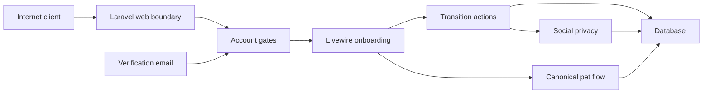

# PawCircle Onboarding Threat Model

Date: 2026-08-30
Scope baseline: `main` at
`48730147fde586108bf79477dff066e5bb1b0ec5`; remediation reviewed through
`1ef8da9512d19bed29ef1fee84efbc07e1494cf5`.

## Executive summary

PawCircle's onboarding foundation has strong outer portal, signed-email,
owner-scoped Action, transaction, and optimistic-version controls. Prompt 01
closed the reproduced stale-verification mutation, pet-manager/private-pet
authority, direct social-target, and parser-confusing return-URL paths. The
remaining material risks are distinguishable duplicate-registration outcomes,
post-commit verification-mail failure, unproved real Livewire transport and
concurrency behavior, and the deliberate missing-row compatibility exception
for any account created outside the canonical registration Action.

## Scope and assumptions

In scope: account registration/login/logout, optional email verification,
password confirmation returns, onboarding middleware/component/forms/Actions,
profile preferences, personal social identity/privacy initialization, pet
create/duplicate/access bridge, session intended URL, and onboarding database
state.

Out of scope: provider-side mail availability, unrelated product modules,
physical devices, payment, WebRTC, CI compromise, host compromise, stolen
`APP_KEY`, and direct attacker writes to the database.

Assumptions:

- The production service is Internet-facing over HTTPS and uses secure session
  cookie/origin/CSRF settings.
- An attacker may be a guest or ordinary member and can craft URLs, form data,
  Livewire payloads, replays, stale tabs, and concurrent submissions.
- The attacker cannot forge Laravel signed URLs or encrypted duplicate tokens
  without `APP_KEY` and cannot change server configuration.
- Email verification is an operationally configurable policy and exact
  boolean `false` is an authorized bypass, not proof of mailbox ownership.
- User instruction explicitly prohibited questions, so deployment scale,
  session backend, mail delivery architecture, and post-registration account
  creation paths remain open questions. Different answers may raise the
  concurrency, missing-row, and delivery-failure priorities.

## System model

### Primary components

- Laravel web middleware owns session resolution, account availability,
  configured verification, onboarding completion, CSRF, and binding order.
- Livewire renders the server-selected onboarding state and submits typed form
  data plus locked optimistic snapshots.
- Focused Actions own registration initialization and each state transition.
- Eloquent persists users, onboarding progress, social actor/settings, pet
  authority, and encrypted access-request evidence in SQLite-compatible schema.
- The canonical pet component owns create, duplicate review, and access
  requests; onboarding records only a relationship decision.
- Laravel notifications and signed routes own email verification.

### Data flows and trust boundaries

- Internet -> Laravel web: credentials, CSRF/session cookie, route parameters,
  signed URLs, and Livewire payload over HTTPS; portal middleware, validation,
  throttles, CSRF, and origin controls apply.
- Laravel session -> account gates: authenticated user, active state,
  verification timestamp, and onboarding row; middleware runs before model
  binding.
- Browser snapshot -> Livewire: form booleans/strings and locked step/version;
  the server must re-resolve the account and never accept user/pet identity or
  a completion timestamp from the snapshot.
- Livewire -> Actions -> database: owner-scoped transitions use transactions,
  row locks, enum validation, canonical domain queries, and optimistic
  versions.
- Browser -> pet bridge: profile form and duplicate/access evidence cross into
  the canonical pet domain; visibility policies and an encrypted expiring
  viewer-bound token limit disclosure.
- Mail link -> verify route: account ID/email hash/expiry/signature cross the
  Internet boundary; authentication, active status, signature, ownership, and
  throttling apply.
- Session intended URL -> redirect response: attacker-influenced navigation is
  consumed only after all gates and must be normalized to one same-origin
  destination.

#### Diagram

## Assets and security objectives

| Asset | Why it matters | Security objective (C/I/A) |
| --- | --- | --- |
| Credentials, session and CSRF state | Compromise permits account takeover or action forgery | C/I/A |
| Verification state | Determines whether an account may enter protected setup/product flows | I |
| Onboarding state/timestamps/version | Proves mandatory choices and controls portal access | I/A |
| Locale/timezone | Controls user-facing language and time interpretation | I |
| Personal social actor/settings | Premature discovery can expose a new account | C/I |
| Pet identity/manager relationships | Wrong authority causes IDOR and private-pet disclosure | C/I |
| Duplicate/access-request evidence | May contain private identity and ownership context | C/I |
| Intended destination | Unsafe values can transfer a trusted user to an attacker origin | I |

## Attacker model

### Capabilities

- Send arbitrary account-entry and product requests and vary method/Accept
  headers.
- Invoke public Livewire action names and tamper with writable snapshot data.
- Replay requests, double-click, retain stale tabs, and race two submissions.
- Supply foreign actor/pet keys, duplicate tokens, choices, locales, timezones,
  and intended URL forms.
- Register multiple accounts and trigger bounded verification/reset surfaces.

### Non-capabilities

- No direct database/session-store/configuration write.
- No valid signature or encrypted-token forgery without application secrets.
- No assumed mailbox, host, deployment-user, dependency registry, or CI
  compromise.
- No authority merely from knowing a stable public key.

## Entry points and attack surfaces

| Surface | How reached | Trust boundary | Notes | Evidence |
| --- | --- | --- | --- | --- |
| Registration/login/reset/confirm | Guest/auth account routes and Livewire updates | Internet -> auth state | Credentials, identity normalization, rates, session changes, return URL | `routes/web.php`; `app/Livewire/Auth`; `app/Actions/RegisterUser.php`; `app/Actions/AuthenticateUser.php` |
| Verification notice/link/resend | Auth routes, signed email URL, Livewire resend | Mail/Internet -> verification state | Configurable, signed, expiring, owner/hash checked, throttled | `app/Services/EmailVerificationMode.php`; `app/Http/Controllers/Auth/VerifyEmailController.php`; `app/Livewire/Auth/VerifyEmail.php` |
| Portal/onboarding middleware | Every web/product request | Session -> product route/binding | Must order guest, active, verification, onboarding before bindings | `bootstrap/app.php`; `app/Http/Middleware/RequirePortalAccess.php`; `app/Http/Middleware/EnsureOnboardingIsComplete.php` |
| Onboarding component | `/onboarding` and Livewire update | Snapshot -> server transition | Locked step/version is not authorization; direct Actions re-check identity | `app/Livewire/Onboarding.php`; `app/Actions/AdvanceUserOnboarding.php`; `app/Actions/CompleteOnboardingPrivacy.php` |
| Pet create/duplicate/access | Exact incomplete-account bridge | Browser -> pet authority/private evidence | No simplified onboarding pet mutation | `app/Livewire/Pets/CreatePetProfile.php`; `app/Services/PetProfileDuplicateReview.php`; `app/Actions/SubmitPetProfileAccessRequest.php` |
| Social discovery/privacy | Onboarding completion and relationship/discovery directories | Account/pet facts -> other members | Profile visibility must cap actor visibility | `app/Services/SocialActorResolver.php`; `app/Services/SocialActorDirectory.php`; `app/Actions/UpdateSocialActorSettings.php` |
| Intended redirect | Login/verification/confirmation/completion | Session navigation -> response Location | Same-origin parser agreement required | `app/Services/SafeIntendedUrl.php`; `app/Livewire/Auth/ConfirmPassword.php` |

## Top abuse paths

1. A verified user mounts onboarding -> verification is later cleared -> stale
   Livewire update is allowlisted -> component/Action that checks only active
   identity mutates preferences/privacy despite the configured gate.
2. A crafted `url.intended` begins with slash-backslash -> the application
   treats it as relative -> a browser interprets it as a network-path redirect
   -> the trusted completion/confirmation flow lands on an attacker origin.
3. A creator receives an own manager row that later expires/revokes ->
   owner-FK query still reports management -> onboarding accepts false managed
   evidence or duplicate search exposes the private profile.
4. A private pet enters the relationship center -> lazy resolver creates a
   discoverable actor -> another member searches the actor directory -> the
   private pet name is disclosed.
5. A noncanonical production account path creates a user without onboarding ->
   missing-row legacy exemption passes -> mandatory privacy/setup is bypassed.
6. Two tabs submit the same or conflicting step/version -> improper replay
   handling rewrites later choices or duplicates side effects -> state and
   privacy diverge.
7. An attacker tampers with step/version/form fields or invokes a future Action
   directly -> weak component-only checks skip prerequisites -> portal access
   is released.
8. An attacker swaps a duplicate token, pet identifier, requester identity, or
   stale visibility -> insufficient reauthorization reveals private candidate
   data or records a foreign access request.

Paths 1 through 4 were reproduced during Prompt 01 and are now covered by the
focused remediation described in TM-001 through TM-004. They remain in this
list as regression scenarios. TM-011 and TM-012 are the unresolved
registration risks that currently prevent a production ship verdict.

## Threat model table

| Threat ID | Threat source | Prerequisites | Threat action | Impact | Impacted assets | Existing controls (evidence) | Gaps | Recommended mitigations | Detection ideas | Likelihood | Impact severity | Priority |
| --- | --- | --- | --- | --- | --- | --- | --- | --- | --- | --- | --- | --- |
| TM-001 | Unverified member with stale Livewire snapshot | Snapshot was mounted while verified or middleware transport is generally allowed | Invoke onboarding/profile mutation after verification is lost | Verification bypass and unapproved state change | Verification, onboarding, privacy | Component and transition Actions now freshly enforce configured verification; focused stale-state tests pass | Real `POST /livewire/update` matrix remains absent | Add real transport tests for guest, inactive, unverified, incomplete, complete, and legacy accounts | Count denied stale updates by non-sensitive reason | low residual | high | medium |
| TM-002 | Remote navigation attacker | Attacker can influence session intended value through a request/referer chain | Use backslash/control/parser-confusing URL or password-confirmation bypass | Trusted open redirect/phishing | Intended destination, session trust | One same-origin service is used after login/onboarding/confirmation and rejects backslash/control/protocol-relative forms | Broader parser/browser dataset remains incomplete | Add connected browser dataset without logging candidate URLs | Log bounded reason code for rejected intended value, never the URL | low residual | medium | low |
| TM-003 | Member with stale/revoked pet relationship | Pet creator FK remains and own manager row becomes inactive | Claim managed pet or search private duplicate despite revoked authority | Pet IDOR/private identity disclosure | Pet identity and manager state | `managedBy`, `visibleTo`, and `PetProfileAccess` now share active membership, legacy fallback, and explicit `deny:view` semantics | Full onboarding invited/future/foreign matrix remains incomplete | Add the remaining transition-level relationship matrix | Audit denied stale-manager decisions by IDs only | low residual | high | medium |
| TM-004 | Ordinary member searching social actors | A private pet actor is lazily provisioned or remains actor-discoverable | Search or target the actor directly | Private pet name/existence leak | Pet privacy and social actor | Resolver/privacy Action cap actor discovery; directory, policy, follow, and request paths reauthorize canonical pet visibility, including locked targets | Idempotent replay returns before locked target reload; it creates no new relationship but lacks stale-model proof | Move replay return after authoritative reload/gates and add stale-target tests | Alert on actor/profile visibility mismatch aggregates | low residual | high | medium |
| TM-011 | Guest probing registration | A valid email may or may not already exist | Compare validation/authentication/redirect outcome for the same otherwise valid registration | Account enumeration | Account identity | Case normalization, database uniqueness, generic localized text, and rate limiting prevent raw database errors and bound probing | Existing and new addresses still produce observably different outcomes | Design a common registration-attempt response and recovery path compatible with verification-enabled and disabled modes | Record only aggregate rejection categories without addresses | medium | medium | high |
| TM-012 | Mail/provider failure | Synchronous verification notification throws after the account transaction commits | Receive a 500, retry registration, then hit the uniqueness boundary | Account stranded before normal login/resend UX | Availability, account identity | User, actor/settings, and onboarding remain atomically committed; normal login/resend exists | Registration component catches only validation failures and has no delivery-failure recovery contract | Report the provider failure safely and return an explicit recoverable login/resend state; fault-injection test | Alert on notification failures by provider/status only | medium | medium | high |
| TM-005 | Noncanonical account creator or data fault | A post-cutover account exists without onboarding row | Rely on legacy exemption to enter portal | Mandatory choices bypassed | Onboarding integrity | `RegisterUser` transaction creates identity/state; unique FK | Missing row intentionally means legacy and has no cutoff marker | Restrict all production creation paths; monitor unexpected missing rows; consider explicit grandfather marker in later migration | Aggregate post-cutover users without rows | low | high | medium |
| TM-006 | Browser payload attacker | Authenticated incomplete account can call Livewire methods | Tamper step/version/user/pet/boolean data or call completion directly | Skipped prerequisites, IDOR, privacy change | Onboarding, privacy, pet | Typed forms, backed enums, `#[Locked]`, owner checks, row locks and versions | Adversarial property/direct-Action coverage incomplete | Add wrong-user/future-step/locked-property/boolean tests; keep IDs absent from API | Count transition conflicts and authorization denials | low | high | medium |
| TM-007 | Same user with two tabs or replay tooling | Two valid requests share an expected version | Race or replay conflicting transitions | Lost update or divergent completion | Onboarding/settings | Transactions, `lockForUpdate`, expected versions, replay rules | No true two-connection concurrency proof | Add real SQLite two-worker and production-adapter contract; one winner/one conflict | Monitor conflict/replay ratios without content | medium | medium | medium |
| TM-008 | Guest/member targeting verification | Possesses or alters link parameters, or mode changes mid-session | Use unsigned/expired/wrong-user link or stale component | Incorrect mailbox trust | Verification/session | Auth/active middleware, expiring signature, email hash owner request, throttle | Negative matrix and stale-update evidence incomplete | Add invalid/expired/wrong-user/replay/mode-change tests | Rate/alert repeated signature and identity failures | low | high | medium |
| TM-009 | Member swapping pet evidence | Can submit foreign keys/tokens or replay a stale candidate set | Probe duplicate candidates or file access request | Private pet/evidence disclosure or unauthorized request | Pet/access evidence | Bounded visible query, encrypted expiring viewer-bound token, Action reauthorization | Full stale-visibility/token-swap matrix absent | Add viewer/species/name/candidate/expiry and post-privacy-change tests | Audit request rejection codes without evidence text | low | high | medium |
| TM-010 | Session fixation attacker | Victim authenticates with attacker-known session state | Reuse old session/CSRF after login or logout | Account takeover/action forgery | Session/credentials | Login/register regenerate; logout invalidates and rotates CSRF | Direct before/after session lifecycle tests absent | Add session ID/cookie/CSRF assertions and connected browser proof | Alert anomalous session reuse/rotation failures | low | high | low |

## Criticality calibration

- Critical: practical unauthenticated account takeover, cross-account medical/
  GPS exfiltration, or remote code execution. Examples: forged session that
  bypasses all gates; arbitrary private-file disclosure at scale.
- High: realistic verification/onboarding bypass or cross-user pet/privacy
  disclosure with meaningful harm. Examples: stale Livewire mutation while
  unverified; private pet discovery after revocation.
- Medium: constrained integrity/privacy issue requiring a member, stale state,
  or uncommon parser/race precondition. Examples: deterministic conflicting
  tabs; unexpected missing-row portal admission.
- Low: defense-in-depth/test-evidence gap with strong existing runtime controls
  and difficult prerequisites. Examples: unproved session rotation despite
  framework calls; noisy bounded abuse with no private-data result.

## Focus paths for security review

| Path | Why it matters | Related Threat IDs |
| --- | --- | --- |
| `bootstrap/app.php` | Global order before CSRF/bindings | TM-001, TM-005, TM-008 |
| `app/Providers/AppServiceProvider.php` | Persistent Livewire middleware and auth mail callbacks | TM-001, TM-008 |
| `app/Http/Middleware/RequirePortalAccess.php` | Guest/active/verification decision tree | TM-001, TM-008 |
| `app/Http/Middleware/EnsureOnboardingIsComplete.php` | Incomplete/legacy portal boundary | TM-005, TM-006 |
| `app/Livewire/Onboarding.php` | Public snapshot/action surface | TM-001, TM-006, TM-007 |
| `app/Actions/RegisterUser.php` | Atomic canonical account entry | TM-005, TM-008 |
| `app/Actions/AdvanceUserOnboarding.php` | State and pet evidence | TM-003, TM-006, TM-007 |
| `app/Actions/CompleteOnboardingPrivacy.php` | Privacy and completion transaction | TM-001, TM-006, TM-007 |
| `app/Services/SafeIntendedUrl.php` | Open-redirect choke point | TM-002 |
| `app/Models/PetProfile.php` | Query-level manager/visibility authority | TM-003, TM-009 |
| `app/Services/SocialActorResolver.php` | Private/default actor provisioning | TM-004 |
| `app/Services/SocialActorDirectory.php` | Cross-user identity projection | TM-004 |
| `app/Services/PetProfileDuplicateReview.php` | Private duplicate evidence | TM-003, TM-009 |
| `tests/Feature/OnboardingTest.php` | State/access/adversarial proof | TM-001..TM-010 |

## Quality check

- [x] Account HTTP, Livewire, verification, pet bridge, privacy, database, and
  intended redirect entry points are represented.
- [x] Every described trust boundary appears in at least one threat.
- [x] Production runtime is separated from tests/build/provider availability.
- [x] Assumptions and unanswered deployment questions are explicit; no user
  questions were asked because the governing prompt forbids them.
- [x] Existing controls are distinguished from gaps and recommended tests.
